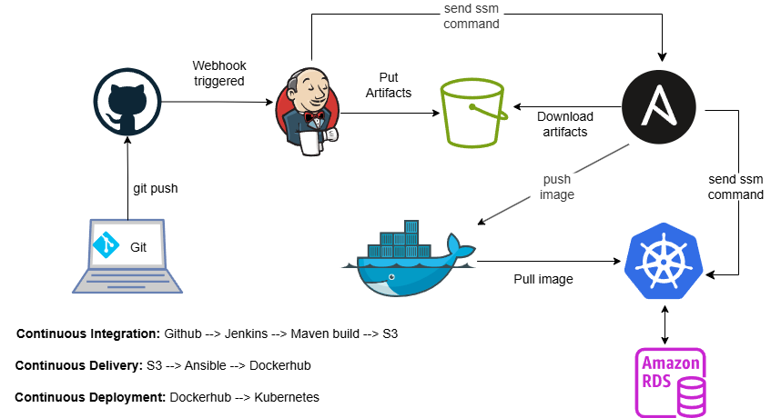

# A production-friendly DevOps Project

This project walks you through the process of constructing a DevOps CI/CD pipeline that can serve a production workload. It follows a microservice architecture where a JAVA web application is packaged as a Docker image with an embedded Tomcat server. This containerized image is deployed and managed as pods in a kubernetes cluster. The containerized App interacts with an RDS-MySQL database making the application dynamic. IaC (with Terraform) and a lot of automation is used rendering the project truly reproducable. 

## Summary of What this Project Achieved 

- Java web application running in containers
- Deployment on Amazon Web Services EKS
- IRSA (IAM Roles for Service Accounts)
- OIDC federation
- EKS pod identity with autoModeConfig enabled
- Amazon Web Services Secrets Manager integration
- Flyway schema migrations at startup
- Passwordless IAM database authentication
- Fine-grained DB privileges for app_user
- Secure JDBC token-based access to Amazon Web Services RDS MySQL

Note

The steps outlined below are steps to create a cluster with autoModeConfig disabled. To create a cluster
with autoModeConfig enabled, [click](#create-cluster-automode) where i have outlined steps and provided files that can be used to achieve that effortlessly.

The DevOps pipeline is realised by using:

* git
* Jenkins 
* Maven
* Ansible
* Docker
* Kubernetes

## Plugins used in the setup
* Jenkins Configuration as Code (JCasC)
* Jenkins Plugins Manager
* Session Manager Plugin

The rest are listed in the plugins.txt file

The userdata scripts of Jenkins, Ansible and K8sbootstrap servers found in the launch template module is embedded with bash and yaml scripts that make this project realisable. One must go through to understand how everything works behind the scenes.

The workflow is illustrated in the diagram below.




## The terraform configuration provisions the following resources

- A VPC
- Availability Zones
- Internet gateway
- NAT Gateway or NAT instance
- Two public subnets in two availability zones
- Four private subnets in two availability zones
- Route tables
- Security groups
- IAM roles
- Ec2 instance profiles with ec2 roles
- Secrets manager secrets
- VPC endpoints
- Random password
- aws_ssm_document
- Openid Connect Provider
- Ec2 instances
- RDS-MySQL
- S3 buckets
- Load balancer
- Target/Autoscaling groups
- kms key and policy

## Steps to reproduce this project

### Prereqisites
* Create two **private** github repos Y and X. Y has the web application and the X is for managing the jekins server. The repo X contains jenkins.yml, plugins.txt and .github. The repo Y contains pom.xml, Jenkinsfile, src/main, jenkins/job.

* Setup a github webhook for the Y repo thus:

1. Payload URL: http://{Load-Balancer-DNS}/github-webhook/
2. Content type: application/json
3. SSL verification: Disable
4. Which events would you like to trigger this webhook? Just the push event.
5. Tick Active at the end then take save.

* Setup a private deploy key used by Jenkins EC2 to access web project GitHub Y repo thus:

1. Generate an SSH key pair with ssh-keygen -t ed25519 -C webapp-repo-key
2. Go to github deploy keys and add the public ssh key
3. Add a title and and click add key
4. Now open the terraform config and paste the private ssh key to /modules/secrets_manager/id_rsa 

* Setup a fine-grained access token to be used for authentication when a webhook is triggered:  

1. Go to fine-grained token in github and click generate a new token
2. Povide a token name, description, resource owner and choose "only selected repositories" under  
   repository access and select the Y repo.
3. Add these permission:
     Read access to metadata
     Read and Write access to code and repository hooks
4. Click generate and copy the token, then open /modules/secrets_manager/webhookpat and paste it

* Setup a fine-grained token for authentication to X github repo by Jenkins when downloading plugins.txt or jenkins.yaml file

1. Follow step 1 above 
2. Choose "only selected repositories" under  repository access and select the X repo.
3. Add these permission:
     Read access to metadata
     Read access to code
4.  Click generate and copy the token, then open /modules/secrets_manager/jenkins-ec2 and paste it.

* Create a backend S3 bucket to store the terraform state file. The bucket name according terraform.tf file is jenkinsbackend.
* Download the terraform config folder to your local machine.
* Install terraform CLI and configure your CLI with your AWS Account access key.
* Create a dockerhub account.

Follow these steps to realise the project
1. Apply the terraform configuration.
2. Connect to the **ansible-host** via SSM and login to dockerhub as **root user** by typing
   ``` docker login```.
3. Connect to the **k8sBootStrapHost** via SSM. Replace the vpc and subnet IDs in the cluster.yml file
   in /opt on the k8sBootstrapHost with the correct values. 
   Create a cluster with the command:
   
   *eksctl create cluster -f /opt/cluster.yml*
   
   Wait until you see "all EKS cluster resources for "my-eks-cluster" have been created". Then on the security group of Control Plane master nodes (i.e. eks-cluster-sg-my-eks-cluster-) you MUST allow all traffic from the security group of the **k8sBootstrapHost**. This is necessary for kubectl commands to work. Login to the AWS console to do that.
4. Edit the security of RDS-MySQL by adding ingress MySQL/Aurora traffic with the security group of 
   Control Plane master nodes as source  
5. Paste the Load balancer DNS name in the browse. Obtain the Jenkins password from secrets manager and 
   paste it in the password field. Username is admin. Ensure not to install any plugins because by this time plugins from the plugins.txt file have been installed. Equally notice that a seed job is already created. 
6. Edit a comment in the Webapp project and commit the change. Jenkins will run the job but will fail.  
   You will have to approve the creation of the webapp-pipeline job by going to settings in jenkins.
7. Perform the first statement in step 5 again. See that the webapp-pipline job is created in Jenkins.
8. Carryout another commit again. That's it. The Jenkinsfile will execute, building and 
   deploying the web app on kubernetes. 
9. Access this webapp running on the pods in the cluster by using the application load balancer created 
   by the AWS load balancer controller. You can get DNS name for the load balancer by running:
   *kubectl get ingress webapp-ingress -n zeus-webapp* on **k8sBootstrapHost**. After that type:
   {ALB-DNS-NAME}/my-webapp/ 
   in the browser to access it. Entering {ALB-DNS-NAME} displays the tomcat server hosting the web app.
10. Clean up by first deleting the updates you made to RDS-MySQL security group. Then run 
    *eksctl delete cluster --name my-eks-cluster --region {AWS-REGION}*. Wait till completion then 
    destroy the infrastructure with terraform destroy.

## Summary of traffic flow

Client

  ↓  HTTP :80
  
AWS ALB (Ingress)

  ↓  HTTP :80
  
Service (ClusterIP) :80

  ↓  TCP: 8080
  
Pod IP :8080

  ↓
  
Container listens on :8080

## Verify created services

Run the following on the k8sBootstrapHost as root

### IAM Service Accounts and Roles
```bash
kubectl get sa aws-load-balancer-controller -n kube-system -o yaml
kubectl describe sa aws-load-balancer-controller -n kube-system -o yaml
kubectl get sa -n zeus-webapp -o yaml
kubectl describe sa webapp-service-account -n zeus-webapp
```
### ALB Controller
```bash
kubectl get deployment -n kube-system aws-load-balancer-controller
kubectl get pods -n kube-system | grep load-balancer
```
### Cluster
```bash
kubectl get nodes -n zeus-webapp
```
### Deployment
```bash
kubectl get deployments -n zeus-webapp
kubectl get pods -n zeus-webapp
```
### Service
```bash
kubectl get service -n zeus-webapp
```
### Ingress
```bash
kubectl get ingress -n zeus-webapp
```
## View Logs

### Server installation logs 
cat /var/log/cloud-init-output.log

### Build logs
Jenkins UI

### Application installation and running logs
S3 bucket: zeus-ec2ssm-logsbu
```bash
kubectl logs deployment/webapp-deployment -n zeus-webapp --tail=100
```
## Security Considerations

- **No direct SSH access** to Jenkins, Ansible kubernetes bootstrap servers
- **Secrets stored in AWS Secrets Manager** (GitHub tokens, passwords)
- **Private subnets** for Jenkins, Ansible kubernetes bootstrap and RDS-MySQL servers
- **Security groups** restrict traffic to necessary ports only
- **SSH keys** for GitHub access managed securely
- **No hardcoded credentials** in scripts or configuration
- **Use of VPC endpoints** for SSM, KMS, S3 and Secrets Manager
- **IAM Database Authentication** used by pod to access RDS-MySQL
- **IRSA (IAM Roles for Service Accounts)** for pods and load balancer controller.

## Create a cluster with autoModeConfig enabled <a id="create-cluster-automode"></a>

Go to the ec2-permissions module and uncomment the section which begins with "Added when using autoModeConfig"

These manifest files listed below are needed on the k8sBootStrapHost. 

- cluster.yml 
- access_entry.sh
- nodeclass.yml
- nodepool.yml
- pod_identity.sh
- deployment.yml
- service.yml
- ingressclass.yml
- ingress.yml

The k8s_bootstrapSetup.sh in the launch-template module has some of the files in the /opt directory. cluster.yml should be modified to suite the one in this repository. Do not modify vpc and subnet IDs. deployment.yml should be replaced completely with the one in this repository. 

It is better to do your modifications after running ```terraform apply -auto-approve ```

Don't forget to add execution permissions to the bash files listed above.

During the creation of the cluster ensure that the k8s bootstrap host can access resource of the cluster by creating an ingress rule in the security group of Control Plane master nodes (i.e. eks-cluster-sg-my-eks-cluster-) to accept traffic from the security group of the k8sBootStrapHost. You can allow all traffic from the k8s bootstrap host. It is necessary for you to apply your manifest files and check status.

Manually Create a security group for the nodepool and give it the tag below as in the nodeclass.yml file:

Name: eks-cluster-sg

Public subnets must be tagged thus:

* kubernetes.io/role/elb: 1
* kubernetes.io/cluster/my-eks-cluster: shared

These tags will help the alb controller in the master node to choose the appropriate subnet to provision the alb.

You can make add inbound and outbound rules to allow all traffic from and to 0.0.0.0/0. Or for fined-grain access, you can allow just outbound MySQL/Aurora traffic to the RDS-database with the RDS-DB security group ID as the destination, and allow inbound TCP on port 8080 from the ALB. The security group name for the ALB will start with "k8s-traffic-myekscluster-". If you are using the all traffic option, you will notice that the entry to allow inbound TCP on port 8080 from the ALB will be automatically added to the inbound rules of your nodepool security group.

Add the nodepool security group as a source of MySQL/Aurora traffic to the security group of RDS instance. I.e. add an inbound rule in the security group of the RDS instance to allow MySQL/Aurora traffic from the security group of the nodepool. This allows the pods in nodepool to access RDS. 

Edit the playbook on ansible to deploy container on cluster by executing the files list above in the given order in which they are listed.

With autoModeConfig enabled, EKS automatically handles compute autoscaling (using karpenter), pods and service networking, application load balancing, cluster DNS, block storage, and GPU support.

Check cluster creation with:
```bash
aws eks describe-cluster \
  --name my-eks-cluster \
  --query "cluster.resourcesVpcConfig"
```


